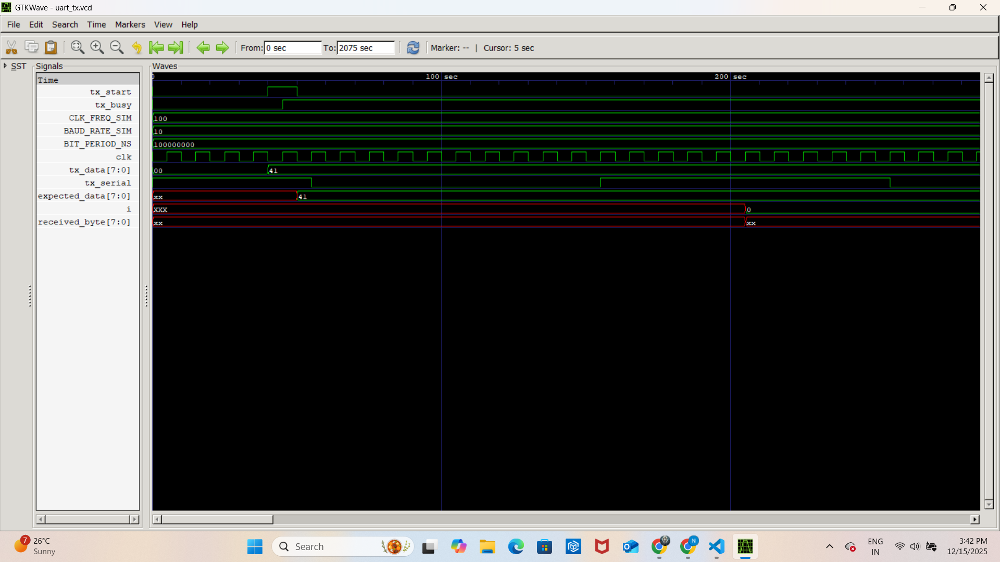

# UART Serial Transmitter IP

## 📝 Description
This repository contains a synthesizable, parameterized **UART (Universal Asynchronous Receiver-Transmitter) Transmitter** designed in Verilog. It enables reliable serial communication between an FPGA/ASIC and external devices (like PC terminals, sensors, or Bluetooth modules) using the standard RS-232 protocol.

## ✨ Key Features
- **Highly Configurable:** Baud rate and System Clock frequency are adjustable via Verilog `parameters`.
- **Resource Efficient:** Uses a minimal slice/LUT count, making it ideal for low-power FPGA designs.
- **Robust Timing:** Features a precision internal Baud Rate Generator to ensure bit-timing accuracy.
- **Simple Interface:** Uses a valid/busy handshake (`tx_start`, `tx_busy`) for easy integration with CPUs or State Machines.

## ⚙️ Theory of Operation
The design operates as a specialized Parallel-to-Serial converter:
1.  **Idle State:** Holds the TX line High (1).
2.  **Start Bit:** Pulls the line Low (0) to initiate transmission.
3.  **Data Serialization:** Shifts out 8 bits of data (LSB first) at the specific baud rate interval.
4.  **Stop Bit:** Returns the line High (1) to conclude the packet.



## 🚀 How to Run
To simulate this design (with fast simulation parameters):

```bash
# Compile
iverilog -g2012 -o uart_sim rtl/uart_tx.v tb/uart_tx_tb.sv

# Run
vvp uart_sim